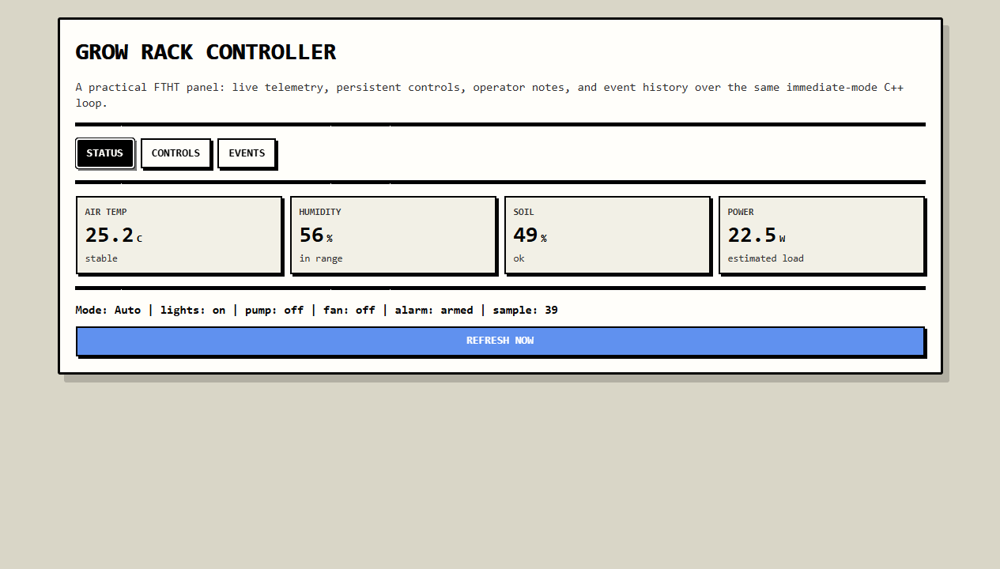
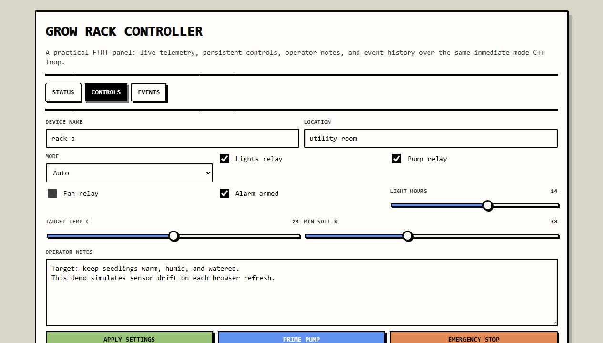
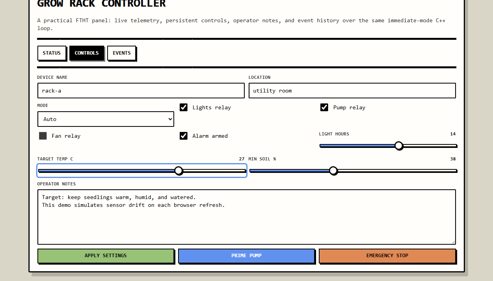
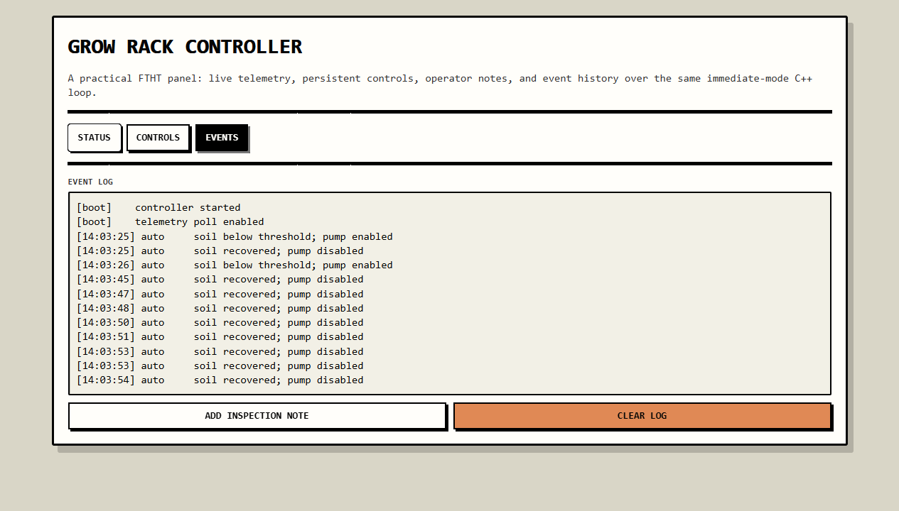

# FTHT

FTHT is a single-header immediate-mode C++ web UI for tiny control panels.

It runs a small embedded HTTP server, renders HTML from direct widget calls, and uses built-in client JavaScript for smooth partial updates. The main target is ESP32-style device dashboards, but the same header also builds on Windows and Linux for local tools.

## Why

- One header to copy into a firmware or utility project
- No CMake required
- No external web framework
- Same simple loop for PCs and microcontrollers
- Small async update payloads for Wi-Fi constrained devices
- Practical widgets for controls, telemetry, settings, logs, and operator notes

## Screenshots

Practical telemetry panel:



Relay and threshold controls:



Slider interaction with live value:



Event log view:



## Quick Start

In exactly one `.cpp` file:

```cpp
#define FTHT_IMPLEMENTATION
#include "ftht.hpp"

int main() {
    ftht::Config cfg;
    cfg.title = "Device Panel";
    cfg.port = 8080;
    cfg.client_poll_ms = 0; // set e.g. 1500 for live dashboards

    if (!ftht::create_server(cfg)) return 1;

    char name[64] = "operator";
    bool enabled = true;

    while (ftht::pump()) {
        ftht::begin();

        ftht::text("Hello from FTHT");
        ftht::input("Name", name, sizeof(name));
        ftht::checkbox("Enabled", &enabled);

        if (ftht::button("Run")) {
            // handle click
        }

        ftht::end();
    }

    ftht::shutdown();
    return 0;
}
```

Open <http://127.0.0.1:8080/> in a browser after starting the program.

## Optional Login

FTHT binds to `0.0.0.0` by default so device panels are reachable from other machines.
Login is optional and off by default:

```cpp
ftht::Config cfg;
cfg.login_mode = ftht::LoginMode::None; // default
```

For a small form login, set a username and password. FTHT stores only a salted hash in
the optional LiteSQL text file:

```cpp
ftht::Config cfg;
cfg.login_mode = ftht::LoginMode::Form;
cfg.login_username = "admin";
cfg.login_password = "change-me";
cfg.login_db_path = "ftht_login.litesql";
cfg.login_allow_registration = true; // optional; prompts the server terminal
```

Use `ftht::make_login_password_hash(password, salt)` if you prefer to pass
`cfg.login_password_hash` instead of a plaintext setup password.

When registration is enabled, browser registration requests are not accepted
automatically. The server prints a terminal prompt for the requested username and
only writes the new salted hash if the operator answers `y`.

For the joke drawing challenge:

```cpp
ftht::Config cfg;
cfg.login_mode = ftht::LoginMode::DrawPenis;
```

The drawing challenge exposes a tiny canvas with rectangle and ellipse tools. It accepts
two nearby ellipses plus one long ellipse or rectangle. Login sessions expire after 10
minutes of inactivity by default; override with `cfg.login_session_seconds`.

## Build

Windows with `clang++`:

```bash
clang++ examples/http_showcase.cpp -o ftht_showcase.exe -std=c++17 -lws2_32
clang++ examples/device_panel.cpp -o ftht_device_panel.exe -std=c++17 -lws2_32
clang++ examples/login_form_demo.cpp -o ftht_login_form_demo.exe -std=c++17 -lws2_32
clang++ examples/login_draw_demo.cpp -o ftht_login_draw_demo.exe -std=c++17 -lws2_32
```

Windows with MSVC:

- `ftht.hpp` includes `#pragma comment(lib, "ws2_32.lib")`.

Linux:

```bash
g++ examples/http_showcase.cpp -o ftht_showcase -std=c++17
g++ examples/device_panel.cpp -o ftht_device_panel -std=c++17
g++ examples/login_form_demo.cpp -o ftht_login_form_demo -std=c++17
g++ examples/login_draw_demo.cpp -o ftht_login_draw_demo -std=c++17
```

## Login Demos

`examples/login_form_demo.cpp` runs on <http://127.0.0.1:8081/> with
username `admin` and password `secret`. It writes `ftht_form_login_demo.litesql`
with salted hashes and enables registration; approve or reject new users in the
terminal running the server.

`examples/login_draw_demo.cpp` runs on <http://127.0.0.1:8082/> and uses the
drawing challenge. Complete the shape challenge to unlock the protected panel.

## ESP32 Shape

```cpp
#include <WiFi.h>
#define FTHT_IMPLEMENTATION
#include "ftht.hpp"

void setup() {
    Serial.begin(115200);
    WiFi.begin("ssid", "password");
    while (WiFi.status() != WL_CONNECTED) delay(100);

    ftht::Config cfg;
    cfg.title = "ESP32 Panel";
    cfg.port = 8080;
    cfg.client_poll_ms = 1500;
    ftht::create_server(cfg);
}

void loop() {
    if (!ftht::pump(0)) return;

    ftht::begin();
    ftht::text("ESP32 is serving this page");
    ftht::end();
}
```

## Widget Surface

- `text`, `text_wrapped`, `separator`, `spacing`
- `input`, `text_area`, `text_area_ex`, `log_view`
- `checkbox`, `slider_float`, `button`
- `dropdown`, `listbox`, `radio_group`, `tabs`
- `row`, `scroll_area`
- `open_modal`, `modal`, `close_modal`
- basic style colors and dark mode

`cfg.client_poll_ms` enables periodic client refresh through the built-in fetch updater. Widget interactions also use fetch updates by default, so controls update without full page reloads.

## Performance

See [docs/performance.md](docs/performance.md) for benchmark commands and current results.

Current desktop loopback numbers for `examples/device_panel.cpp`:

- full page load: about `13.9 KB`
- async poll/update response: about `1.1 KB`
- async update payload reduction: about `91.8%`
- browser DOM parse/swap sample: about `1.37 ms`

## Repository Layout

- `ftht.hpp`: single-header library
- `examples/http_showcase.cpp`: basic browser/server demo
- `examples/device_panel.cpp`: practical telemetry and relay-control panel
- `docs/screenshots/`: README screenshots
- `docs/performance.md`: benchmark notes and measurements
- `tools/bench_http.py`: stdlib HTTP payload/latency benchmark helper
